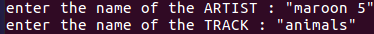
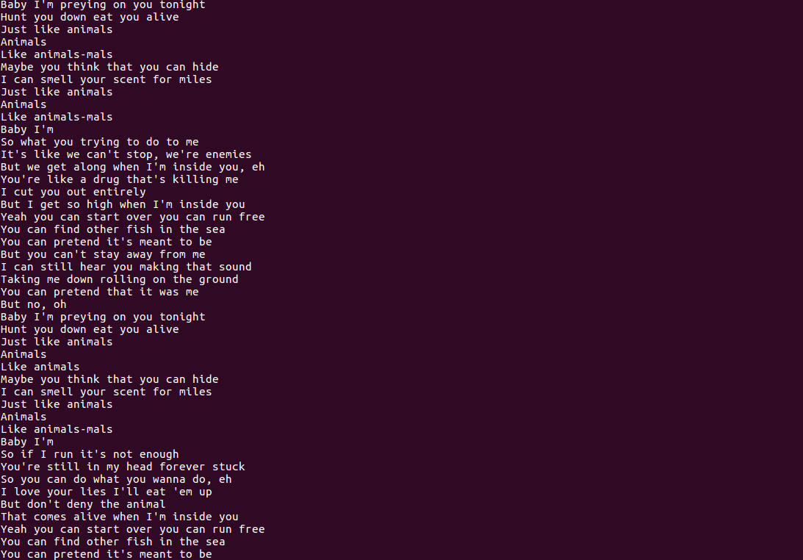

# LYRICS
A small function to find and show the lyrics of a particular song
asked by the user.
the function takes name of artist and the track as input from the user.

##### this is a project for KOSS,IIT kharagpur and is used for educational purpose only.

### Language Used

Python 2.7

### Dependencies

* requests
* BeautifulSoup4

### Input

### Output

### FUTURE Develpoments
1. Improving the Command Line Interface.
2. Adding a Graphical User Interface for better usability.

